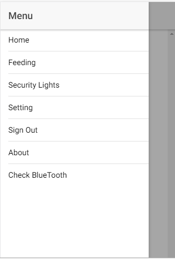

# feedr
Remote Fish feeding tool to easily feed fish and monitor schedule and amounts for each given time the fish is fed. We are implementing this using the Ionic framework and an Arduino to help with the remote side (Bluetooth / RTC modules come in at this stage)

- We are also using Intel XDK to develop some UI Components that we can later integrate with the main files in Ionic

ScreenShots > <a href = "https://github.com/Kaminto/feedr/blob/master/feedrUI/src/app/app.component.ts">Code</a>

